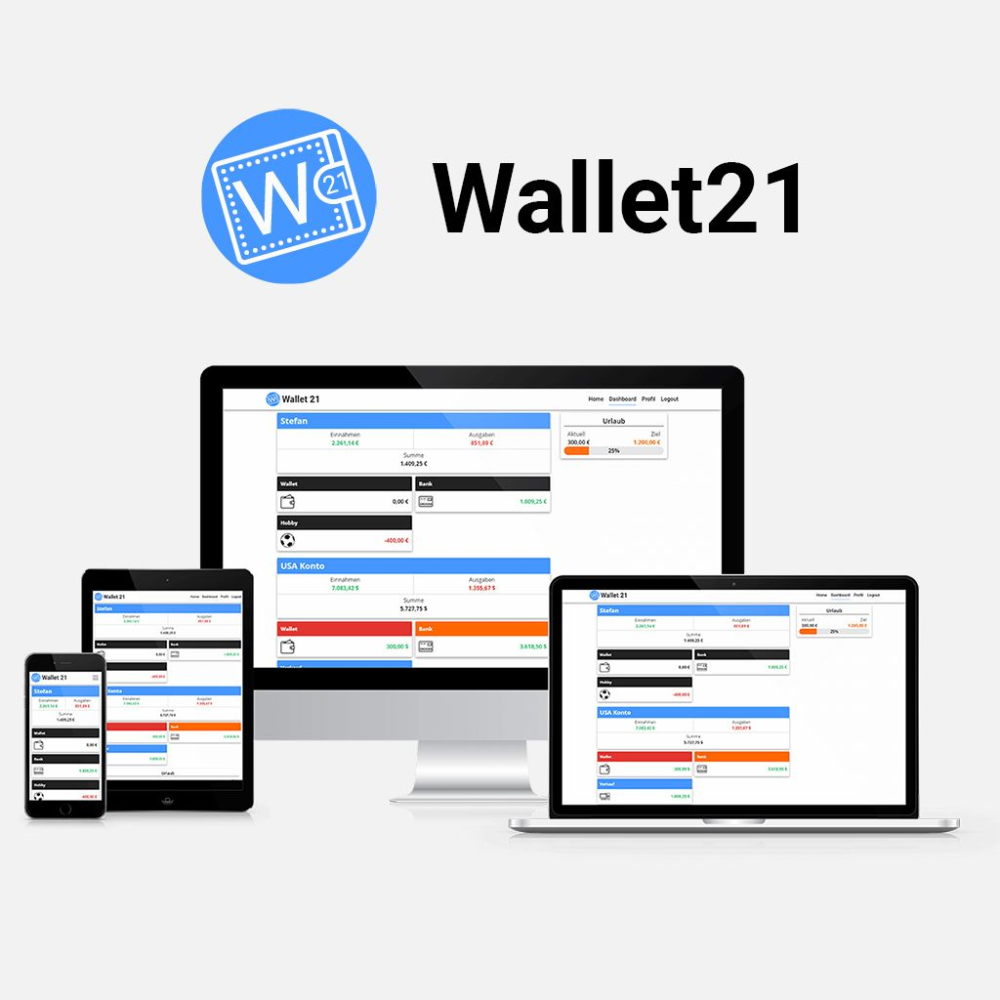
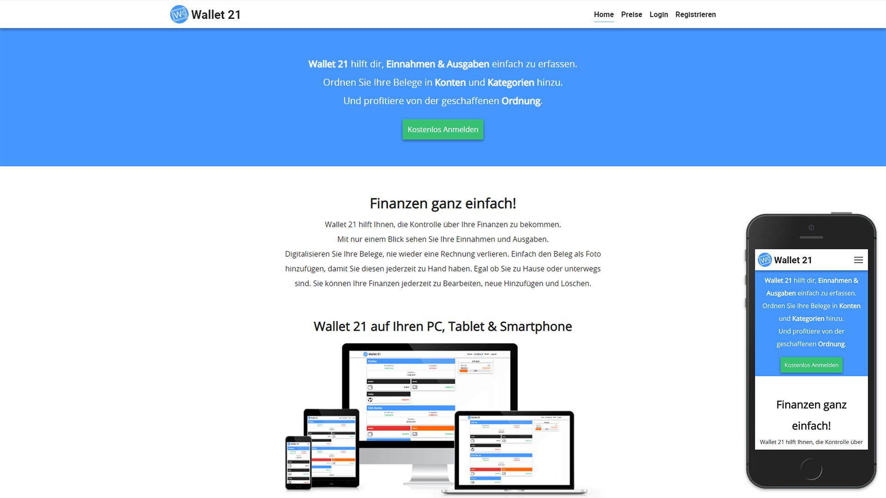
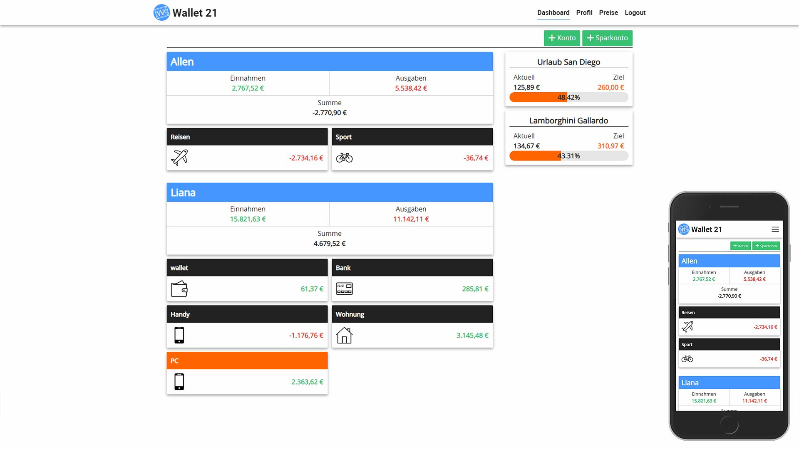
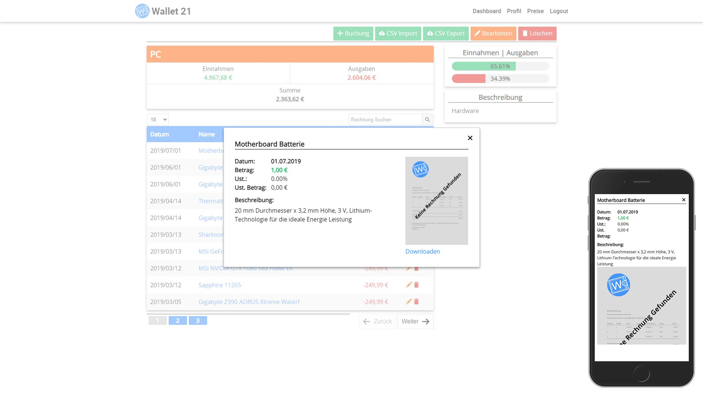
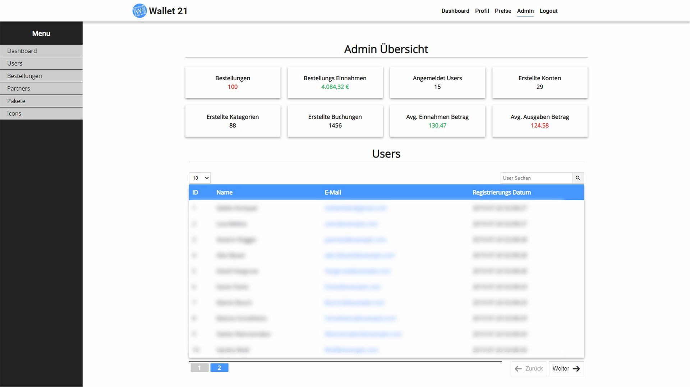

# Wallet21 

### home

### dashboard

### booking

### admin dashboard

# Wallet 21 - Install Guide:

##Install Video Guide:

    https://youtu.be/mQgittYwbnU

Die Website ist unter folgender URL zu erreichen:

    http://wallet21.22web.org
    E-Mail: UserTest@example.com
    Passwort: password
    Alternative einen Neuen Account erstellen
    
    Backup:  http://w21.web1337.net/
    

Damit der Ordner nicht zu groß ist sind Folgende Dateien mithilfe des Terminals zu installieren.
Composer und NPM.

    composer install
    npm install

## Setting ".env"
Github Download:

    cp .env.example .env'
    
#### Settings    
Datenbank MySQL (Settings für Xampp)

Mailer GMail:
Damit GMail auch mails versenden kann muss "Zugriff durch weniger sichere Apps" aktiviert sein.

    APP_NAME="Wallet 21"
    APP_URL=http://127.0.0.1:8000/
    
    DB_CONNECTION=mysql
    DB_HOST=127.0.0.1
    DB_PORT=3306
    DB_DATABASE=wallet21 
    DB_USERNAME=root
    DB_PASSWORD=
    
    MAIL_FROM_NAME="Wallet 21 Team"
    MAIL_DRIVER=smtp
    MAIL_HOST=smtp.googlemail.com
    MAIL_PORT=465
    MAIL_USERNAME=YourGmailName@gmail.com
    MAIL_PASSWORD=YourGmailPassword
    MAIL_ENCRYPTION=ssl

Bei ändern der APP_URL muss 'npm run prod' neu ausgeführt werden!
z.B.: wallet21.dev 

    npm run prod 

## Datenbank
Connect Sie sich mit ihrer Datenbank und erstellen sie wallet21 oder den Namen den Sie zuvor bei den Einstellungen (.env) getroffen haben.

    XAMMP/Laragon Login: 
    Name: localhost
    Host: 127.0.0.1
    Username: root
    Password: 
    
    Programme zum Connecten:
    Windows: 
    MySQL Workbench
    Download: https://www.mysql.com/de/products/workbench/
    Mac:
    Sequel Pro
    Download: https://www.sequelpro.com/    
   
    
### Datenbank Importieren 
Wählen sie in ihren Programm 'Wallet21' aus und SQL Importieren, anschließend wählen Sie die Dump.sql aus

Alternative können Sie mithilfer folgender befehler die Datenbank über migration befüllen. 

    php artisan migrate
    php artisan db:seed

 
## Website Start
Geben Sie im Terminal 

    php artisan serve

Anschließen Können Sie im Browser unter:

    http://127.0.0.1:8000/ 

die Seite erreichen.

Default Users Bei der Impotierung der Datenbank sind:

    - Admin:
        - E-mail: admin@example.com
        - Password: password
    - User:
        - E-mail: user@example.com
        - Password: password
        
        

    Im Ordner Beispiel Dateinen befindet sich Files zum Test
    - CSV Import (CSV_Import.csv)
    - Rechnungs Image (upc.jpg,bill-reconstruct.png)
    - Icon (github.svg)
    
MFG. Stefan K.
    
    PS: 
    Windows empfehlung Laragon oder XAMMP 
    Download Laragon: https://laragon.org/download/
    Download XAMPP: https://www.apachefriends.org/de/download.html

    Mac XAMPP (Version: 7.3.6-3)
    Download: https://www.apachefriends.org/de/download.html
    
    Alernative können Sie auch Homestead verwenden. 
    Wichtig host-file URL muss mit der APP_URL übereinstimmen 
    

###Alle Accounts
    Jeder Account hat als Passwort "password" als standart Passwort!
    
    - Admin
        E-Mail: admin@example.com
        Password: password
    - User
        E-Mail: user@example.com
        E-Mail: alex.Bauer@example.com
        E-Mail: Hargrove@example.com
        E-Mail: Parks@example.com
        E-Mail: Buschr@example.com
        E-Mail: Wannemaker@example.com
        E-Mail: Eberhardt@example.com
        E-Mail: Himmel@example.com
        E-Mail: Fleischer@example.com
        Password: password
    - Partner
        E-Mail: partner@example.com
        E-Mail: Wulf@example.com
        E-Mail: brainsystems@example.com
        E-Mail: Schultheiss@example.com
        Password: password
        
